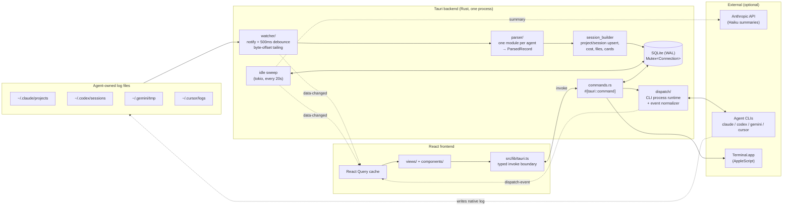
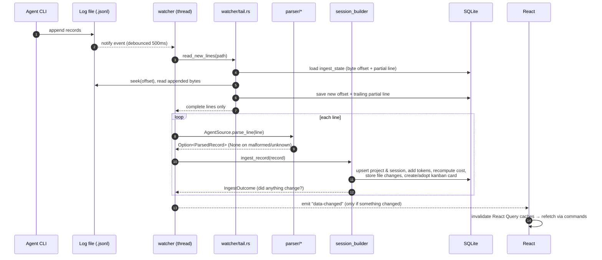
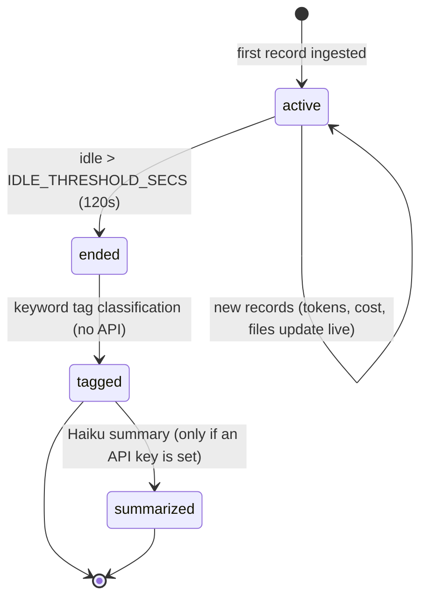
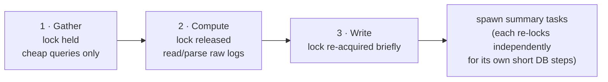
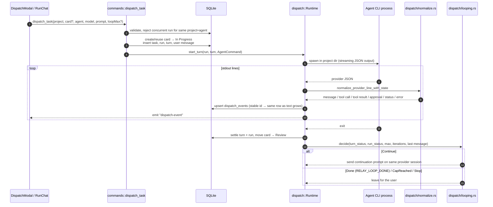
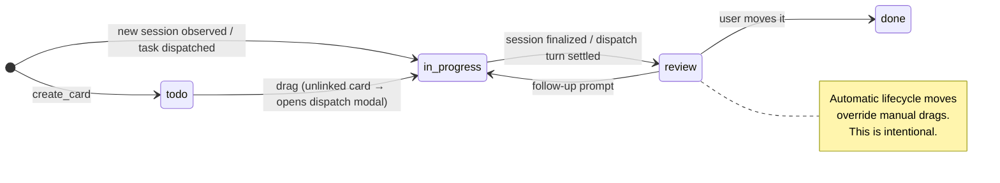
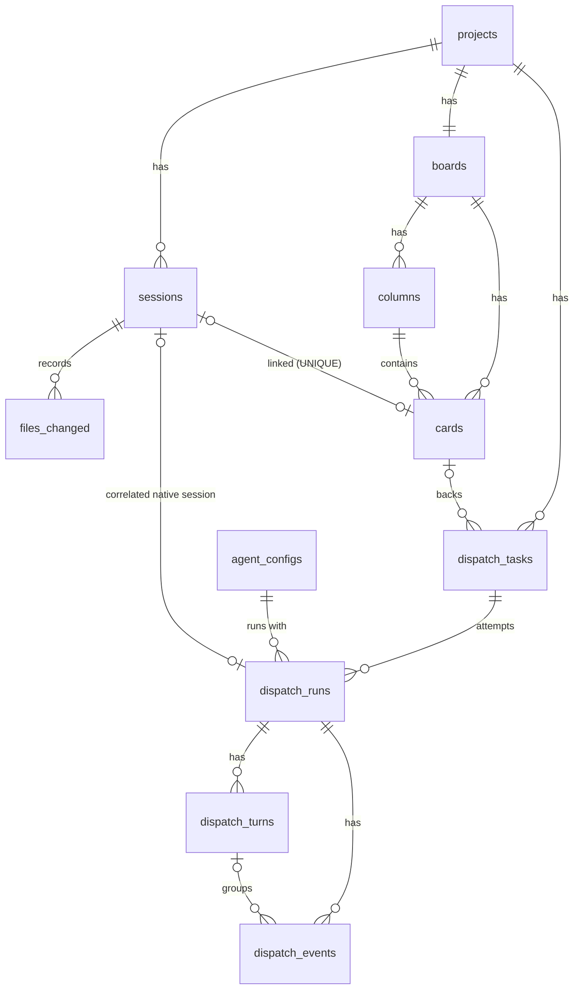
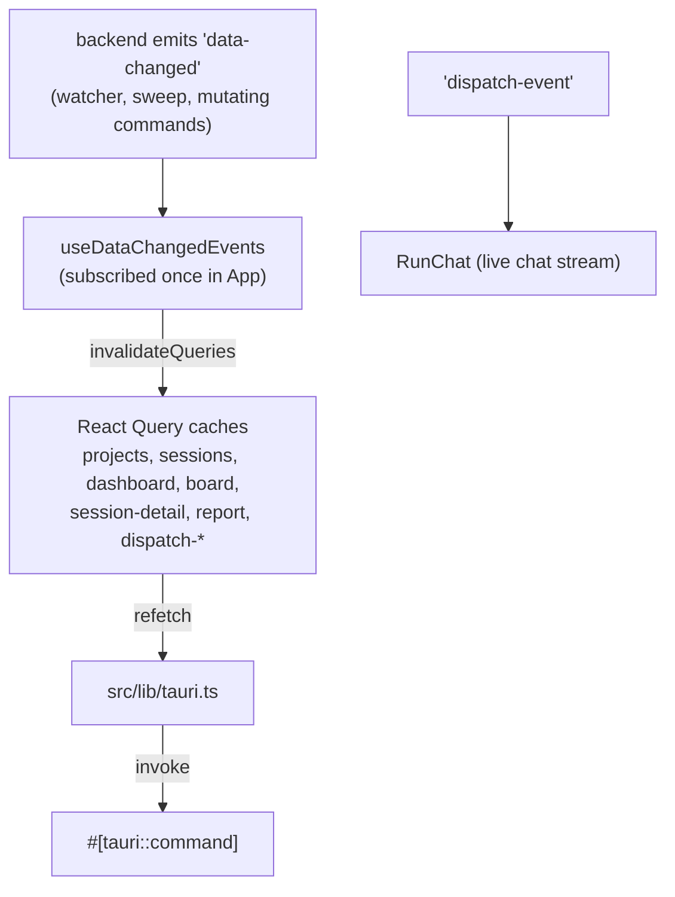

# Relay

**A local-first desktop control plane for AI coding agents — "Datadog for AI coding agents."**

Relay watches the session logs that CLI coding agents write to disk, turns them into a normalized local SQLite database, and gives you a live dashboard of every project, session, file change, and dollar spent. It can also launch agents itself: dispatch a task from a kanban card, chat with the agent as it works, and let it loop until the task is done.

One process, one SQLite file, no server, no telemetry. Built with **Tauri 2 (Rust)** and **React 19 + TypeScript**. macOS only for now.

---

## Table of contents

- [Features](#features)
- [Quick start](#quick-start)
- [Architecture](#architecture)
  - [System overview](#system-overview)
  - [Passive ingestion pipeline](#passive-ingestion-pipeline)
  - [Session lifecycle & the idle sweep](#session-lifecycle--the-idle-sweep)
  - [Active dispatch](#active-dispatch)
  - [Kanban card lifecycle](#kanban-card-lifecycle)
  - [Data model](#data-model)
  - [Frontend data flow](#frontend-data-flow)
- [Architecture decisions](#architecture-decisions)
- [Repository layout](#repository-layout)
- [Contributing](#contributing)
  - [Development setup](#development-setup)
  - [Testing & checks](#testing--checks)
  - [Common contribution recipes](#common-contribution-recipes)
  - [Code conventions](#code-conventions)
  - [Pull request checklist](#pull-request-checklist)
  - [Where help is wanted](#where-help-is-wanted)
- [Privacy](#privacy)

---

## Features

| Area | What it does |
| --- | --- |
| **Home** | Ongoing agent work, total spend, an activity heatmap, top projects, and spend per agent. |
| **Projects** | Every working directory an agent has run in, found automatically. Includes git activity, recent commits, sessions, and a per-project kanban board. |
| **Sessions** | Every agent session with live token counts, cost, changed files with diffs, tags, an optional AI summary, and a copyable or exportable transcript. |
| **Timeline** | A chronological feed you can filter by project, tag, and date range. |
| **Reports** | 7/30/90-day spend and token breakdowns, exported as Markdown to `~/Downloads`. |
| **Agent work** | Chats with agents Relay launched: streamed messages, tool calls, approvals, stop/resume/retry, and an optional "loop until done" mode. |
| **Connections** | Per agent: turn dispatch on or off, set the executable path, and choose available and default models. |

Supported agents:

| Agent | Log location watched | Status |
| --- | --- | --- |
| Claude Code | `~/.claude/projects/**/*.jsonl` | **Verified** against real logs |
| Codex | `~/.codex/sessions/**/*.jsonl` | Best-effort |
| Gemini CLI | `~/.gemini/tmp/**/*.jsonl` | Best-effort |
| Cursor Agent | `~/.cursor/logs/**/*.jsonl` | Best-effort |

---

## Quick start

### Requirements

- macOS (terminal attach uses Terminal.app + AppleScript)
- [Node.js](https://nodejs.org/) 24+ and npm. The frontend tests use Node's built-in TypeScript support.
- [Rust](https://rustup.rs/), stable toolchain (minimum is `rust-version` in `src-tauri/Cargo.toml`)
- At least one supported agent CLI that you've used at least once, so its log directory exists

### Run it

```bash
npm install
npm run tauri dev
```

The first launch compiles the Rust backend, which takes a few minutes. Later launches are incremental. On startup Relay backfills every existing log file and then tails new writes live.

Local state is kept in Tauri's app-data directory (`~/Library/Application Support/com.relay.app/`) as `relay.db`.

### Optional: AI session summaries

When a session ends, Relay can generate a one-sentence summary with Claude Haiku. Everything else works without this. Relay looks for a key in this order, once at startup:

1. The `ANTHROPIC_API_KEY` environment variable
2. `"api_key"` in `<app_data_dir>/config.json`

If no key is found, Relay logs that once and skips summaries.

### Optional: terminal attach

"Launch / attach" on a kanban card controls Terminal.app through AppleScript. macOS will ask for **Accessibility** and **Automation** permissions the first time.

---

## Architecture

### System overview

Relay has two independent ways to get data in. They share one database and one UI.

- **Passive observability:** Relay watches log files from agents you started yourself in a terminal.
- **Active dispatch:** Relay starts an agent CLI as a child process and stores the conversation itself.



### Passive ingestion pipeline



Things to know:

- **Agent-agnostic core.** Debounce, backfill, and dedup don't depend on the agent. Each agent is one row in the `AGENT_SOURCES` table in `src-tauri/src/watcher/mod.rs`: root dir function, file extension, and `parse_line` function.
- **Defensive parsing.** These logs are undocumented internal formats that can change upstream. Every parser returns `Option` and skips anything it doesn't recognize. A parser must never panic.
- **Tombstones.** A session deleted in Relay is recorded in `deleted_sessions`, so later watcher activity on its log file won't bring it back.

### Session lifecycle & the idle sweep



`spawn_idle_sweep` in `src-tauri/src/lib.rs` runs every `SWEEP_INTERVAL_SECS` (20s) in **three phases**. This structure is load-bearing:



The whole app shares one `Mutex<Connection>`. If the sweep held it during a file read or an `.await` on the Anthropic API, every UI command, the watcher, and the next sweep tick would stall until that finished.

### Active dispatch



- **The runtime owns only live processes.** Conversation identity, transcript, and resume state are stored in SQLite, so a provider process can exit between turns. On startup, runs left active by a previous Relay process are marked `interrupted` but can still be resumed.
- **Loop until done** (`dispatch/looping.rs`). After each turn that completes cleanly, Relay sends a continuation prompt. It stops when the agent's final message contains `RELAY_LOOP_DONE` or when it hits the iteration cap (at most 50). Interrupted turns, failed turns, and turns waiting on approval always stop the loop. A failing CLI would otherwise burn money in a tight loop. The stopping rules are pure functions with unit tests.
- **Linking to native logs.** When Relay launches a CLI, the native session ID doesn't exist yet. So the card gets a `pending_launch_at` stamp, and the first matching new session the watcher sees within that window adopts the card.

### Kanban card lifecycle



Each project board has four columns with fixed roles (`todo`, `in_progress`, `review`, `done`). Users can add custom columns that have no role.

### Data model



Standalone tables: `ingest_state` (per-file byte offset and partial line), `deleted_sessions` (tombstones), and `auth_state` (left over from a removed feature).

The schema changes only through numbered migrations in `src-tauri/migrations/`, applied at startup by `rusqlite_migration` in `db::open`.

### Frontend data flow



There is no polling. The event payload is deliberately coarse ("something changed"), so query shapes can change on the Rust side without keeping an event type in sync in two languages. The cost is broader refetches than strictly necessary.

---

## Architecture decisions

Each entry covers what was chosen, why, and what it costs. Read these before proposing a change to the underlying design.

| # | Decision | Why | Trade-off |
| --- | --- | --- | --- |
| 1 | **Read agents' own log files** instead of wrapping or proxying the CLIs | No setup, works with sessions started anywhere, and never touches the agent's traffic | Log formats are undocumented and change upstream, so parsers must be defensive. Only Claude Code is verified. |
| 2 | **Local-first: one process, embedded SQLite, no server** | Privacy, zero ops, instant startup, works offline | No multi-machine sync or team view. The DB lives in one app-data directory. |
| 3 | **Tauri 2 + Rust** rather than Electron | Small binary, native file watching and process control, strong typing where parsing happens | Contributors need a Rust toolchain. Terminal attach is macOS-specific. |
| 4 | **One `Mutex<Connection>`** instead of a connection pool | A single writer is simple and enough at this scale. WAL keeps reads cheap. | Every DB access is serialized, which is why lock discipline (#5) is required. |
| 5 | **Never hold the DB lock across file I/O, network, subprocess, or `.await`** (gather → compute → write) | One slow log read or hung API call would otherwise freeze the whole app | Code is more verbose: re-lock per phase, re-check state after re-locking. |
| 6 | **Incremental byte-offset tailing** with a buffered partial line | Growing logs are never re-parsed from scratch, and half-flushed lines are never parsed | Offset state lives in `ingest_state`. A truncated or rewritten log restarts from 0. |
| 7 | **Per-agent parsers emit one normalized `ParsedRecord`** and are registered in a table | Adding an agent is local: a parser module plus one table row | Fields that some agents don't provide (usage, file edits) end up empty for those agents. |
| 8 | **Coarse `data-changed` event + React Query invalidation**, no polling | No event payload schema to keep in sync across Rust and TypeScript | Broader refetches than strictly needed. |
| 9 | **`src/lib/tauri.ts` is the only place that calls `invoke`** | One typed boundary, so a Rust command change breaks in one TypeScript file | Every new command needs a wrapper there. |
| 10 | **Costs recomputed from tokens at every startup** against bundled `pricing.json` | Fixing the pricing table corrects historical data retroactively | The table covers Claude families. Unknown models fall back to a default rate. |
| 11 | **Tags from a keyword heuristic; summaries optional via Haiku** | Useful with no API key. Summaries cost fractions of a cent and happen once per session. | Heuristic tags are approximate. |
| 12 | **Dispatch conversations stored in SQLite; runtime holds only live children** | Conversations survive Relay restarts and CLI exits, and can be resumed with the provider session ID | Startup has to mark orphaned runs as `interrupted`. |
| 13 | **Loop mode stops only on an explicit marker or a hard cap (≤ 50)** | Unattended loops spend real money. The marker isn't a phrase an agent would write by accident, and failures never auto-retry. | The agent has to be told to emit `RELAY_LOOP_DONE`. |
| 14 | **Lifecycle column moves override manual drags** | The board shows real agent state (anything finalized goes to Review) | A card can seem to "jump" columns. This is intended, not a bug. |
| 15 | **Prompt delivered to Terminal.app by clipboard paste**, not keystrokes | Typed newlines would submit a multi-line prompt early in Claude Code's input | Needs Accessibility and Automation permissions, and briefly uses the clipboard. |
| 16 | **Exports are Markdown written to `~/Downloads` plus a `reveal_in_finder` follow-up** | Portable and readable, and gives the same UX for every export | Follow this pattern for any new export feature. |
| 17 | **Append-only numbered migrations** | Existing user databases upgrade safely in place | Dead schema (for example `auth_state`) stays unless a new migration drops it. |

Longer design notes are in `docs/superpowers/specs/`. `docs/PLAN.md` and `docs/SPEC.md` are the original roadmap and are **out of date** compared with the code.

---

## Repository layout

```
relay/
├── src/                          React frontend
│   ├── App.tsx                   view switching (no router)
│   ├── lib/tauri.ts              ★ typed invoke() boundary: the only place invoke is called
│   ├── lib/types.ts              TS mirrors of Rust command payloads
│   ├── hooks/useDataChangedEvents.ts   event → React Query invalidation
│   ├── views/                    one view per nav item + modals
│   └── components/
│       ├── board/                kanban board
│       ├── dispatch/             DispatchModal, RunChat
│       ├── nav/  ui/             sidebar, shared primitives (plain CSS, no UI framework)
├── tests/                        frontend unit tests (node --test)
├── src-tauri/
│   ├── migrations/               0001…00NN .sql (append-only)
│   ├── resources/                pricing.json, attach_session.applescript
│   ├── tests/fixtures/           parser fixtures
│   └── src/
│       ├── lib.rs                startup wiring, command registration, idle sweep
│       ├── commands.rs           every #[tauri::command]
│       ├── watcher/              mod.rs (AGENT_SOURCES, debounce, backfill), tail.rs
│       ├── parser/               claude_jsonl, codex_jsonl, gemini_log, cursor_jsonl,
│       │                         record (ParsedRecord), session_builder, transcript
│       ├── db/                   mod.rs (open + migrations), queries.rs (all SQL)
│       ├── dispatch/             mod.rs (CLI commands), runtime.rs, normalize.rs, looping.rs
│       ├── cost/pricing.rs       tokens → USD
│       ├── summarize/            Anthropic key resolution, prompts, Haiku calls
│       ├── tags.rs  activity.rs  terminal.rs
├── docs/                         original plan/spec + design specs
└── landing-page/                 separate Next.js marketing site (independent project)
```

---

## Contributing

Contributions are welcome: bug fixes, parser hardening for the best-effort agents, tests, and UI polish.

### Development setup

```bash
git clone <repo-url> relay && cd relay
npm install
npm run tauri dev          # Vite + native window, frontend hot-reload
```

Use the Tauri dev log to debug ingestion. Parser and watcher warnings go through the `log` crate at `Info` level in debug builds.

### Testing & checks

Run these before opening a PR. CI (`.github/workflows/ci.yml`) runs the same checks on every pull request and push to `main`:

```bash
# Rust (from src-tauri/)
cargo fmt --check
cargo clippy --all-targets
cargo check
cargo test                              # full suite
cargo test --lib db::queries            # one module
cargo test -p app <test_name>           # one test

# Frontend (from repo root)
npx tsc -b                              # typecheck
npm run lint                            # oxlint
node --test tests/*.test.ts             # pure-function unit tests
```

Where tests live:

- **Rust:** inline `#[cfg(test)] mod tests` in `commands.rs`, `tags.rs`, `watcher/tail.rs`, `cost/pricing.rs`, `activity.rs`, `db/queries.rs`, `summarize/prompts.rs`, `dispatch/looping.rs`, and every `parser/*.rs`. Parser fixtures are in `src-tauri/tests/fixtures/`.
- **Frontend:** there's no component test framework. Move logic into pure functions (see `src/views/diffClipboard.ts`, `src/lib/clipboard.ts`), test them in `tests/`, and describe how you checked the UI by hand in your PR.

> If `cargo test` fails before compiling with paths from another machine, your `src-tauri/target` cache is stale. Run `cargo clean` in `src-tauri/`.

### Common contribution recipes

<details>
<summary><b>Add or improve support for an agent's logs</b></summary>

1. Put a real, anonymized log sample in `src-tauri/tests/fixtures/`.
2. Add or edit `src-tauri/src/parser/<agent>.rs`. Map lines to `ParsedRecord` (`parser/record.rs`) and return `None` for anything you don't recognize. **Never `unwrap` on log data.**
3. Write tests against the fixture, including malformed and truncated lines.
4. Register it with a new `AgentSource` entry in `AGENT_SOURCES` (`watcher/mod.rs`): root dir function, extension, and `parse_line`.
5. If the agent reports token usage, add its models to `src-tauri/resources/pricing.json`.
6. For dispatch support, add its non-interactive command in `dispatch/mod.rs` and its stream mapping in `dispatch/normalize.rs`.

</details>

<details>
<summary><b>Add a database-backed feature</b></summary>

1. Add `src-tauri/migrations/00NN_<name>.sql`. **Never edit an existing migration.**
2. Register it at the end of the `Migrations::new` list in `src-tauri/src/db/mod.rs`.
3. Put the SQL in `db/queries.rs` (or a new focused module under `db/`) and add tests using an in-memory connection.
4. Add a narrow `#[tauri::command]` in `commands.rs` and register it in `generate_handler!` in `lib.rs`.
5. Add TypeScript types in `src/lib/types.ts` and a wrapper in `src/lib/tauri.ts`.
6. Fetch the data with React Query. If the command changes state, emit `data-changed` and add the query key to `useDataChangedEvents.ts` if it's new.

</details>

<details>
<summary><b>Touch the idle sweep, watcher, or any shared state</b></summary>

- Read the doc comments in `lib.rs` and `watcher/mod.rs` first. They explain the locking rules.
- Keep the gather → compute → write phases. Take the lock, copy out what you need, **drop it**, do the slow work, then lock again briefly to write.
- A spawned task must acquire the lock itself. Don't pass it a guard.
- Explain *why* in the doc comment of any new code that touches shared state.

</details>

<details>
<summary><b>Update model pricing</b></summary>

Edit `src-tauri/resources/pricing.json` (per-token rates for prompt, completion, cache read, and cache write). Lookup order is exact model name, then longest matching prefix, then the default rate. Costs are recomputed at the next startup, so historical sessions are corrected automatically. Add a case to the tests in `cost/pricing.rs`.

</details>

<details>
<summary><b>Add an export</b></summary>

Follow `export_report` and `export_transcript`: render Markdown with a pure, testable function, write it to Downloads, return the path, and give the user a `reveal_in_finder` action.

</details>

### Code conventions

- **Degrade, don't crash.** Missing git, malformed logs, missing directories, and API failures become logged warnings and empty or zero results. They never become errors that break the UI.
- **Rust comments explain why**: concurrency, failure modes, and why the obvious alternative was rejected. Match the style of the surrounding code.
- **No `invoke` outside `src/lib/tauri.ts`.**
- **Plain CSS** next to each component (`Component.tsx` + `Component.css`), using the shared tokens in `src/styles/`.
- **Don't "fix" intended behavior**: lifecycle column moves overriding drags (#14), and summaries silently disabled when there's no key.
- `landing-page/` is a separate Next.js project with its own tooling and `AGENTS.md`. Keep changes to it in separate PRs.

### Pull request checklist

The same list is pre-filled in new PRs from `.github/pull_request_template.md`. Title PRs and commits as [Conventional Commits](https://www.conventionalcommits.org/) (`feat(board): ...`, `fix(watcher): ...`).

- [ ] `cargo fmt --check`, `cargo clippy --all-targets`, and `cargo test` pass (from `src-tauri/`)
- [ ] `npx tsc -b`, `npm run lint`, and `node --test tests/*.test.ts` pass
- [ ] New parsing or pure logic has tests. Parsers are tested against fixtures, including malformed input.
- [ ] Any schema change is a **new** migration and is registered in `db::open`
- [ ] New commands are registered in `lib.rs` and wrapped in `src/lib/tauri.ts`
- [ ] No DB lock held across I/O, subprocess, network, or `.await`
- [ ] UI changes were checked by hand in `npm run tauri dev` (add a screenshot for visual changes)
- [ ] The PR description explains *why*, especially for anything in [Architecture decisions](#architecture-decisions)

### Where help is wanted

Known gaps, which make good first issues:

- **Verify the non-Claude parsers** against real Codex, Gemini CLI, and Cursor Agent logs, and add fixtures.
- **Transcripts, tags, and summaries for other agents.** `parser/transcript.rs` always uses the Claude parser, so these features only work fully for Claude Code sessions.
- **Pricing for non-Claude models.** `pricing.json` covers Claude families only.
- **Split up `db/queries.rs`**, which is now several thousand lines, into domain modules.
- **Frontend tests** beyond pure functions.
- **Security hardening.** The Tauri CSP is currently disabled (`"csp": null`), and some providers receive prompts as process arguments.
- **Cleanup.** Remove the leftover `@supabase/supabase-js` dependency and fill in the placeholder `Cargo.toml` metadata.
- **Windows and Linux.** Everything except terminal attach is portable in principle.

---

## Privacy

Session data, the database, and your code stay on your machine. Relay has no telemetry and no backend. Two exceptions, both under your control:

- **AI summaries** (only if you provide an Anthropic API key) send the session's first request, the agent's final response, and the changed file paths to the Anthropic API.
- **Dispatched agents** are the regular agent CLIs, and they talk to their own providers just as they do when you run them in a terminal.

Relay only reads agent log directories. It never writes to them.
